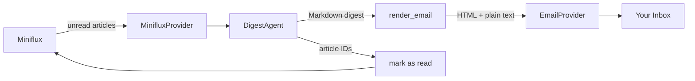

# How It Works

minizen runs a linear pipeline: fetch unread articles → curate and summarise with AI →
send the digest by email → mark articles as read.

## Steps

### 1. Fetch unread articles

`MinifluxProvider` calls the Miniflux API and returns all unread entries as a list of
`Article` objects — each with its ID, title, URL, content, feed name, and publication date.

### 2. Curate and summarise

`DigestAgent` sends the articles to an LLM via [pydantic-ai](https://ai.pydantic.dev/).
The agent selects the top N most significant articles and writes a cohesive Markdown digest,
returning a `DigestResult` with the Markdown text and the IDs of the articles it used.

### 3. Render the email

The Markdown digest is converted to HTML and a plain-text fallback using
[mistune](https://mistune.lepture.com/). Styles are inlined for broad email client compatibility.

### 4. Send the email

`EmailProvider` opens a STARTTLS SMTP connection, authenticates, and delivers the
multipart HTML/plain-text email to the configured recipient.

### 5. Mark as read

The article IDs returned by the agent are marked as read in Miniflux, so they won't
appear in tomorrow's digest.
