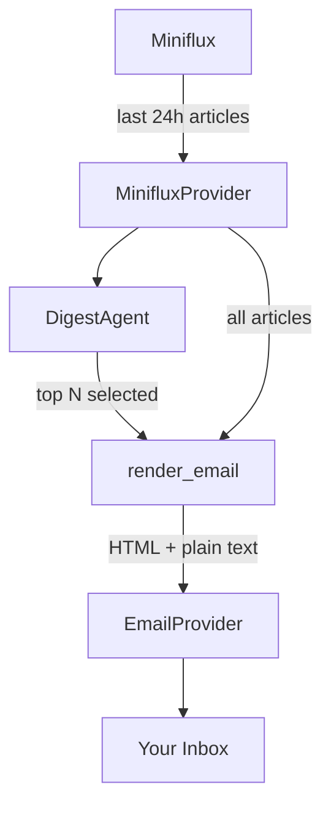

# How It Works

minizen runs a linear pipeline: fetch articles from the last 24 hours → curate and
summarise with AI → render a digest with full summaries plus a link list → send by email.

## Steps

### 1. Fetch recent articles

`MinifluxProvider` calls the Miniflux API and returns all entries published in the last
24 hours, regardless of read status. Each entry becomes an `Article` object with its ID,
title, URL, content, feed name, and publication date.

### 2. Curate and summarise

`DigestAgent` sends the articles to an LLM via [pydantic-ai](https://ai.pydantic.dev/).
The agent selects the top N most significant articles and writes a cohesive Markdown digest,
returning a `DigestResult` with the Markdown text and the IDs of the articles it used.

### 3. Render the email

The Markdown digest is converted to HTML and a plain-text fallback using
[mistune](https://mistune.lepture.com/). Styles are inlined for broad email client
compatibility. Articles not selected for full summaries appear as a compact "More to read"
link list at the bottom.

### 4. Send the email

`EmailProvider` opens a STARTTLS SMTP connection, authenticates, and delivers the
multipart HTML/plain-text email to the configured recipient.
