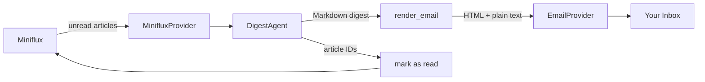

# Public API & Documentation Implementation Plan

> **For agentic workers:** REQUIRED SUB-SKILL: Use superpowers:subagent-driven-development (recommended) or superpowers:executing-plans to implement this plan task-by-task. Steps use checkbox (`- [ ]`) syntax for tracking.

**Goal:** Expose minizen's core building blocks as a clean importable Python API, and expand the documentation site with a proper homepage, architecture diagram, configuration reference, FAQ, and AI disclaimer.

**Architecture:** Sub-package `__init__.py` files each export their own public symbols; the top-level `__init__.py` re-exports everything into a single flat namespace with `__all__`. Documentation is written as dedicated Markdown pages registered in `zensical.toml`.

**Tech Stack:** Python sub-package imports, `__all__`, pytest; MkDocs via zensical, Mermaid diagrams via `pymdownx.superfences`.

---

## File map

### Part 1 — Public API

| Action | File |
|---|---|
| Modify | `src/minizen/config/__init__.py` |
| Modify | `src/minizen/providers/rss/__init__.py` |
| Modify | `src/minizen/providers/email/__init__.py` |
| Modify | `src/minizen/ai/__init__.py` |
| Modify | `src/minizen/core/__init__.py` |
| Modify | `src/minizen/__init__.py` |
| Create | `tests/test_public_api.py` |

### Part 2 — Documentation

| Action | File |
|---|---|
| Modify | `README.md` |
| Modify | `docs/how_it_works.md` |
| Modify | `docs/getting-started.md` |
| Create | `docs/configuration.md` |
| Create | `docs/faq.md` |
| Create | `docs/ai-disclaimer.md` |
| Modify | `zensical.toml` |

---

## Task 1: Public API — expose sub-package symbols

**Files:**
- Create: `tests/test_public_api.py`
- Modify: `src/minizen/config/__init__.py`
- Modify: `src/minizen/providers/rss/__init__.py`
- Modify: `src/minizen/providers/email/__init__.py`
- Modify: `src/minizen/ai/__init__.py`
- Modify: `src/minizen/core/__init__.py`
- Modify: `src/minizen/__init__.py`

- [ ] **Step 1: Write the failing test**

Create `tests/test_public_api.py`:

```python
"""Tests that all public symbols are importable from their declared locations."""
import minizen
from minizen import (
    AIConfig,
    Article,
    DigestAgent,
    DigestResult,
    EmailConfig,
    EmailProvider,
    MinifluxConfig,
    MinifluxProvider,
    Settings,
    load_settings,
    run_pipeline,
)
from minizen.ai import DigestAgent as _DigestAgent
from minizen.ai import DigestResult as _DigestResult
from minizen.config import AIConfig as _AIConfig
from minizen.config import EmailConfig as _EmailConfig
from minizen.config import MinifluxConfig as _MinifluxConfig
from minizen.config import Settings as _Settings
from minizen.config import load_settings as _load_settings
from minizen.core import run_pipeline as _run_pipeline
from minizen.providers.email import EmailProvider as _EmailProvider
from minizen.providers.rss import Article as _Article
from minizen.providers.rss import MinifluxProvider as _MinifluxProvider


def test_top_level_all() -> None:
    # arrange
    expected = {
        "AIConfig",
        "Article",
        "DigestAgent",
        "DigestResult",
        "EmailConfig",
        "EmailProvider",
        "MinifluxConfig",
        "MinifluxProvider",
        "Settings",
        "load_settings",
        "run_pipeline",
    }

    # act / assert
    assert set(minizen.__all__) == expected


def test_top_level_imports_are_same_objects() -> None:
    assert run_pipeline is _run_pipeline
    assert load_settings is _load_settings
    assert Settings is _Settings
    assert AIConfig is _AIConfig
    assert EmailConfig is _EmailConfig
    assert MinifluxConfig is _MinifluxConfig
    assert EmailProvider is _EmailProvider
    assert Article is _Article
    assert MinifluxProvider is _MinifluxProvider
    assert DigestAgent is _DigestAgent
    assert DigestResult is _DigestResult
```

- [ ] **Step 2: Run test to confirm it fails**

```bash
uv run pytest tests/test_public_api.py -v
```

Expected: `ImportError` — cannot import `AIConfig`, `Article`, etc. from `minizen`.

- [ ] **Step 3: Implement `src/minizen/config/__init__.py`**

```python
"""Public configuration API for minizen."""
from minizen.config.loader import load_settings
from minizen.config.models import AIConfig, EmailConfig, MinifluxConfig, Settings

__all__ = ["AIConfig", "EmailConfig", "MinifluxConfig", "Settings", "load_settings"]
```

- [ ] **Step 4: Implement `src/minizen/providers/rss/__init__.py`**

```python
"""Public RSS provider API for minizen."""
from minizen.providers.rss.miniflux import Article, MinifluxProvider

__all__ = ["Article", "MinifluxProvider"]
```

- [ ] **Step 5: Implement `src/minizen/providers/email/__init__.py`**

```python
"""Public email provider API for minizen."""
from minizen.providers.email.smtp import EmailProvider

__all__ = ["EmailProvider"]
```

- [ ] **Step 6: Implement `src/minizen/ai/__init__.py`**

```python
"""Public AI agent API for minizen."""
from minizen.ai.agent import DigestAgent, DigestResult

__all__ = ["DigestAgent", "DigestResult"]
```

- [ ] **Step 7: Implement `src/minizen/core/__init__.py`**

```python
"""Public core pipeline API for minizen."""
from minizen.core.pipeline import run_pipeline

__all__ = ["run_pipeline"]
```

- [ ] **Step 8: Implement `src/minizen/__init__.py`**

Replace the existing file (which only contains `__version__`) with:

```python
"""minizen — A quieter way to stay informed."""
from minizen.ai import DigestAgent, DigestResult
from minizen.config import AIConfig, EmailConfig, MinifluxConfig, Settings, load_settings
from minizen.core import run_pipeline
from minizen.providers.email import EmailProvider
from minizen.providers.rss import Article, MinifluxProvider

__version__ = "0.0.0"

__all__ = [
    "AIConfig",
    "Article",
    "DigestAgent",
    "DigestResult",
    "EmailConfig",
    "EmailProvider",
    "MinifluxConfig",
    "MinifluxProvider",
    "Settings",
    "load_settings",
    "run_pipeline",
]
```

- [ ] **Step 9: Run all tests to confirm they pass**

```bash
uv run pytest -v
```

Expected: all tests pass including `tests/test_public_api.py`.

- [ ] **Step 10: Commit**

```bash
git add tests/test_public_api.py src/minizen/__init__.py src/minizen/config/__init__.py src/minizen/providers/rss/__init__.py src/minizen/providers/email/__init__.py src/minizen/ai/__init__.py src/minizen/core/__init__.py
git commit -m "feat: expose public API via sub-package and top-level imports"
```

---

## Task 2: Configuration reference page

**Files:**
- Create: `docs/configuration.md`
- Modify: `zensical.toml`

- [ ] **Step 1: Create `docs/configuration.md`**

```markdown
# Configuration Reference

minizen reads its configuration from a TOML file (default `~/.config/minizen/config.toml`)
and secrets from environment variables.

---

## Config file

```toml
[ai]
model = "anthropic:claude-haiku-4-5"
top_n = 5

[miniflux]
url = "https://reader.miniflux.app"

[email]
smtp_host = "smtp.gmail.com"
smtp_port = 587
from_addr = "you@example.com"
to_addr = "you@example.com"
```

### `[ai]` section

| Key | Type | Default | Description |
|---|---|---|---|
| `model` | string | `"anthropic:claude-haiku-4-5"` | pydantic-ai model identifier |
| `top_n` | integer | `5` | Maximum articles to include in the digest |

#### Supported models

minizen uses [pydantic-ai](https://ai.pydantic.dev/) for LLM integration.
Any provider it supports works:

| Provider | Example `model` value | Required env var |
|---|---|---|
| Anthropic | `anthropic:claude-haiku-4-5` | `ANTHROPIC_API_KEY` |
| OpenAI | `openai:gpt-4o-mini` | `OPENAI_API_KEY` |

### `[miniflux]` section

| Key | Type | Default | Description |
|---|---|---|---|
| `url` | string | `"https://reader.miniflux.app"` | Base URL of your Miniflux instance (no `/v1/` suffix) |

### `[email]` section

| Key | Type | Default | Description |
|---|---|---|---|
| `smtp_host` | string | — | SMTP server hostname |
| `smtp_port` | integer | — | SMTP port (typically `587` for STARTTLS) |
| `from_addr` | string | — | Sender email address |
| `to_addr` | string | — | Recipient email address |

---

## Environment variables

Secrets are never stored in the config file. Set them in your shell or in
`~/.config/minizen/.env` (created automatically by `minizen setup`).

| Variable | Purpose |
|---|---|
| `MINIFLUX_API_KEY` | Miniflux API key for authentication |
| `ANTHROPIC_API_KEY` | Anthropic API key (if using an Anthropic model) |
| `OPENAI_API_KEY` | OpenAI API key (if using an OpenAI model) |
| `MINIZEN_EMAIL_USERNAME` | SMTP login username |
| `MINIZEN_EMAIL_PASSWORD` | SMTP login password or app password |

---

## Custom config path

The default config path is `~/.config/minizen/config.toml`.
Pass a custom path with `--config`:

```bash
minizen --config /path/to/config.toml run
```
```

- [ ] **Step 2: Add Configuration to `zensical.toml` nav**

After the `"How It Works"` nav entry and before the `Changelog` entry, add:

```toml
[[project.nav]]
Configuration = "configuration.md"
```

- [ ] **Step 3: Verify the page renders**

```bash
just docs
```

Open `http://localhost:8000` and confirm the Configuration page appears in the nav and all tables render correctly.

- [ ] **Step 4: Commit**

```bash
git add docs/configuration.md zensical.toml
git commit -m "docs: add configuration reference page"
```

---

## Task 3: FAQ page

**Files:**
- Create: `docs/faq.md`
- Modify: `zensical.toml`

- [ ] **Step 1: Create `docs/faq.md`**

```markdown
# FAQ

## What RSS readers are supported?

minizen supports [Miniflux](https://miniflux.app) only — either the hosted version at
[reader.miniflux.app](https://reader.miniflux.app) or a self-hosted instance.

## Which AI providers and models work?

minizen uses [pydantic-ai](https://ai.pydantic.dev/) under the hood,
so any provider it supports will work. Tested providers:

- **Anthropic** — set `model = "anthropic:claude-haiku-4-5"` and provide `ANTHROPIC_API_KEY`
- **OpenAI** — set `model = "openai:gpt-4o-mini"` and provide `OPENAI_API_KEY`

See the [Configuration reference](configuration.md) for the full list of env vars.

## Can I use a non-Gmail SMTP server?

Yes. minizen uses standard STARTTLS SMTP. Set `smtp_host`, `smtp_port`,
`MINIZEN_EMAIL_USERNAME`, and `MINIZEN_EMAIL_PASSWORD` for any SMTP provider
(Fastmail, Outlook, Mailgun, Postmark, etc.).

## What happens if there are no unread articles?

minizen exits cleanly with a log message — no email is sent and no articles are
marked as read.

## How do I test the digest without sending a real email?

Three commands let you run progressively more of the pipeline:

```bash
# Fetch articles only — no AI, no email
minizen digest fetch

# Generate the digest in your terminal — no email sent
minizen digest preview

# Send to your inbox without marking articles as read
minizen digest send-test
```

Add `--dry-run` to skip all external side-effects (useful in CI or scripting).

## The digest didn't arrive — what should I check?

1. Run `minizen config validate` to check your settings.
2. Run `minizen digest fetch` to confirm articles are being fetched from Miniflux.
3. Check your spam or junk folder.
4. For Gmail: verify your App Password is correct and 2-Step Verification is enabled.
5. Try `minizen digest send-test` and watch the logs for SMTP errors.
```

- [ ] **Step 2: Add FAQ to `zensical.toml` nav**

After the `Configuration` nav entry, add:

```toml
[[project.nav]]
FAQ = "faq.md"
```

- [ ] **Step 3: Verify the page renders**

```bash
just docs
```

Open `http://localhost:8000` and confirm the FAQ page appears in the nav and all code blocks render correctly.

- [ ] **Step 4: Commit**

```bash
git add docs/faq.md zensical.toml
git commit -m "docs: add FAQ page"
```

---

## Task 4: AI Disclaimer page

**Files:**
- Create: `docs/ai-disclaimer.md`
- Modify: `zensical.toml`

- [ ] **Step 1: Create `docs/ai-disclaimer.md`**

```markdown
# AI Disclaimer

## AI-powered digest

minizen uses large language models (LLMs) — via [pydantic-ai](https://ai.pydantic.dev/) —
to select and summarise your RSS articles. The AI curates the top N articles and writes
the digest text.

The output is generated by an AI model and may contain inaccuracies, omissions, or
summaries that do not fully reflect the original articles. Always refer to the original
article links in your digest for complete and accurate information.

## AI-assisted development

minizen was built with the assistance of [Claude Code](https://claude.ai/code) by Anthropic.
AI was used throughout development for code generation, design, and review.
```

- [ ] **Step 2: Add AI Disclaimer to `zensical.toml` nav**

After the `FAQ` nav entry and before the `Changelog` entry, add:

```toml
[[project.nav]]
"AI Disclaimer" = "ai-disclaimer.md"
```

- [ ] **Step 3: Verify the page renders**

```bash
just docs
```

Open `http://localhost:8000` and confirm the AI Disclaimer page appears in the nav.

- [ ] **Step 4: Commit**

```bash
git add docs/ai-disclaimer.md zensical.toml
git commit -m "docs: add AI disclaimer page"
```

---

## Task 5: Expand README (homepage)

**Files:**
- Modify: `README.md`

- [ ] **Step 1: Replace the contents of `README.md`**

```markdown
# minizen — A quieter way to stay informed

**minizen** fetches your unread RSS articles from [Miniflux](https://miniflux.app),
uses AI to curate and summarise the most interesting ones, and emails you a clean daily digest.

- **Curated, not firehosed** — the AI picks your top N articles and writes a cohesive
  narrative, not a bullet dump
- **Runs on a schedule** — ships with a GitHub Actions workflow for a hands-free daily digest,
  no server required
- **Dry-run friendly** — preview the digest in your terminal before a single email is sent
- **Pluggable AI** — works with Anthropic Claude or OpenAI models via
  [pydantic-ai](https://ai.pydantic.dev/)

## Quick start

```bash
uv tool install minizen
minizen setup            # interactive wizard — configure Miniflux, AI, and email
minizen digest preview   # preview today's digest in your terminal
minizen run              # fetch → summarise → send
```

→ [Getting Started](https://hieudao-code.github.io/minizen/getting-started/) for full setup instructions

→ [How It Works](https://hieudao-code.github.io/minizen/how_it_works/) for the architecture
```

- [ ] **Step 2: Verify the homepage renders**

```bash
just docs
```

Open `http://localhost:8000` and confirm the homepage shows the feature list and quick-start snippet.

- [ ] **Step 3: Commit**

```bash
git add README.md
git commit -m "docs: expand README homepage with features and quick-start"
```

---

## Task 6: How It Works — Mermaid diagram + explanation

**Files:**
- Modify: `docs/how_it_works.md`
- Modify: `zensical.toml` (enable Mermaid if not already working)

- [ ] **Step 1: Enable Mermaid in `zensical.toml`**

Replace the existing `[project.markdown_extensions.pymdownx.superfences]` entry (currently empty) with:

```toml
[project.markdown_extensions.pymdownx.superfences]
custom_fences = [
  {name = "mermaid", class = "mermaid", format = "!!python/name:pymdownx.superfences.fence_code_format"},
]
```

Also add the Mermaid JS loader under `[project.theme]` (after the `features` key):

```toml
[project.theme]
features = ["content.code.copy", "content.tooltips"]

[[project.theme.custom_dir]]
# no custom dir needed

[project.extra]
extra_javascript = ["https://unpkg.com/mermaid@11/dist/mermaid.min.js"]
```

> **Note:** `zensical` may already wire up Mermaid differently. Run `just docs` after this step. If the diagram renders as a code block instead of a diagram, check the [zensical Mermaid docs](https://zensical.org/docs/authoring/diagrams/?h=mermaid#configuration) and adjust the config accordingly.

- [ ] **Step 2: Replace `docs/how_it_works.md`**

```markdown
# How It Works

minizen runs a linear pipeline: fetch unread articles → curate and summarise with AI →
send the digest by email → mark articles as read.



## Steps

### 1. Fetch unread articles

`MinifluxProvider` calls the Miniflux API and returns all unread entries as a list of
`Article` objects — each with its ID, title, URL, content, feed name, and publication date.

### 2. Curate and summarise

`DigestAgent` sends the articles to an LLM via [pydantic-ai](https://ai.pydantic.dev/).
The agent selects the top N most significant articles and writes a cohesive Markdown digest,
returning a `DigestResult` with the Markdown text and the IDs of the articles it used.

### 3. Render the email

The Markdown digest is converted to HTML and a plain-text fallback using
[mistune](https://mistune.lepture.com/). Styles are inlined for broad email client compatibility.

### 4. Send the email

`EmailProvider` opens a STARTTLS SMTP connection, authenticates, and delivers the
multipart HTML/plain-text email to the configured recipient.

### 5. Mark as read

The article IDs returned by the agent are marked as read in Miniflux, so they won't
appear in tomorrow's digest.
```

- [ ] **Step 3: Verify the diagram renders**

```bash
just docs
```

Open `http://localhost:8000/how_it_works/` and confirm:

- The flowchart renders as a diagram (not a fenced code block)
- All five pipeline steps are visible in the text

- [ ] **Step 4: Commit**

```bash
git add docs/how_it_works.md zensical.toml
git commit -m "docs: add Mermaid architecture diagram to how-it-works page"
```

---

## Task 7: Update Getting Started — provider-agnostic email

**Files:**
- Modify: `docs/getting-started.md`

- [ ] **Step 1: Update the Prerequisites section**

Replace:

```markdown
- A Gmail account with an [App Password](https://support.google.com/accounts/answer/185833)
```

With:

```markdown
- An SMTP-capable email account (Gmail is the most common — see below)
```

- [ ] **Step 2: Update the email-related setup table rows**

Replace the four Gmail-specific rows in the setup prompt table:

```markdown
| **SMTP host**          | Default: `smtp.gmail.com`                                                                              |
| **SMTP port**          | Default: `587`                                                                                         |
| **From email address** | The Gmail address minizen sends from                                                                   |
| **To email address**   | Where you want to receive digests                                                                      |
| **Email username**     | Your Gmail address                                                                                     |
| **Email password**     | Your Gmail [App Password](https://support.google.com/accounts/answer/185833) (not your login password) |
```

With:

```markdown
| **SMTP host**          | Your SMTP server hostname (e.g. `smtp.gmail.com`)                                                      |
| **SMTP port**          | SMTP port — use `587` for STARTTLS (works with most providers)                                         |
| **From email address** | The address minizen sends from                                                                         |
| **To email address**   | Where you want to receive digests                                                                      |
| **Email username**     | Your SMTP login username (often your email address)                                                    |
| **Email password**     | Your SMTP password or app password (see your provider's docs)                                          |
```

- [ ] **Step 3: Replace the "Getting a Gmail App Password" section**

Replace the entire `### Getting a Gmail App Password` section with:

```markdown
### Email provider setup

minizen works with any SMTP server that supports STARTTLS on port 587.

**Gmail** is the most common choice. To use it:

1. Go to your Google Account → Security
2. Under "How you sign in to Google", enable 2-Step Verification if not already on
3. Search for "App passwords" in your Google Account settings
4. Create a new App Password (e.g. name it `minizen`)
5. Copy the 16-character password — use this as your **Email password**

For other providers (Fastmail, Outlook, Proton Mail Bridge, etc.), consult your
provider's SMTP documentation. The `smtp_host`, `smtp_port`, username, and password
fields map directly to your provider's settings.

See the [Configuration reference](configuration.md) for all available settings.
```

- [ ] **Step 4: Verify the page renders**

```bash
just docs
```

Open `http://localhost:8000/getting-started/` and confirm the email section describes SMTP generically with Gmail as the worked example.

- [ ] **Step 5: Commit**

```bash
git add docs/getting-started.md
git commit -m "docs: make email setup provider-agnostic in getting-started"
```
