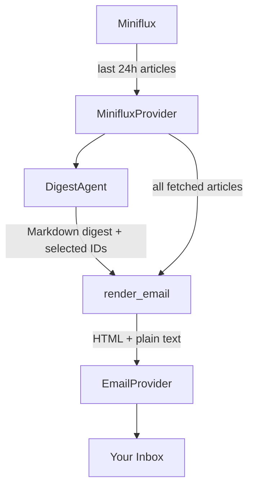

# Fetch Recent Articles & Link List Implementation Plan

> **For agentic workers:** REQUIRED SUB-SKILL: Use superpowers:subagent-driven-development (recommended) or superpowers:executing-plans to implement this plan task-by-task. Steps use checkbox (`- [ ]`) syntax for tracking.

**Goal:** Replace unread-based article fetching with a 24-hour time window and append non-selected articles as a compact link list at the bottom of each digest email.

**Architecture:** Five code changes in sequence — update `MinifluxProvider` to fetch by publish time (no status filter, no mark-as-read), update `render_email()` to accept and render extra article links, update the pipeline to wire the new method and pass the link list, update the CLI digest sub-commands, and finally update docs and configuration reference.

**Tech Stack:** miniflux Python client (`after_published_at` query param), freezegun (time-frozen tests), mistune (HTML rendering), pydantic-ai.

---

### Task 1: Update MinifluxProvider

Rename `fetch_unread()` → `fetch_recent()`, change the API call to filter by publish timestamp instead of read status, and remove `mark_as_read()` entirely.

**Files:**
- Modify: `src/minizen/providers/rss/miniflux.py`
- Modify: `tests/providers/rss/test_miniflux.py`

- [ ] **Step 1: Write the failing tests**

Replace `tests/providers/rss/test_miniflux.py` with the following. Key changes: all `fetch_unread` → `fetch_recent`, `get_entries` assertion checks `after_published_at` instead of `status`, add freeze_time, remove `test_mark_as_read_calls_client_with_ids`.

```python
import json
from datetime import UTC, datetime, timedelta
from pathlib import Path
from typing import TYPE_CHECKING

from freezegun import freeze_time

from minizen.config.models import MinifluxConfig
from minizen.providers.rss.miniflux import MinifluxProvider

if TYPE_CHECKING:
    from pytest_mock import MockerFixture


@freeze_time("2026-05-04T10:00:00Z")
def test_fetch_recent_calls_api_with_24h_cutoff(mocker: MockerFixture) -> None:
    # arrange
    mock_client_cls = mocker.patch("minizen.providers.rss.miniflux.miniflux.Client")
    mock_client_cls.return_value.get_entries.return_value = {"total": 0, "entries": []}
    config = MinifluxConfig(url="https://rss.example.com", api_key="key")
    provider = MinifluxProvider(config=config)

    # act
    provider.fetch_recent()

    # assert
    expected_ts = int(
        (datetime(2026, 5, 4, 10, 0, 0, tzinfo=UTC) - timedelta(hours=24)).timestamp()
    )
    mock_client_cls.return_value.get_entries.assert_called_once_with(
        after_published_at=expected_ts
    )


@freeze_time("2026-05-04T10:00:00Z")
def test_fetch_recent_returns_articles(mocker: MockerFixture) -> None:
    # arrange
    mock_client_cls = mocker.patch("minizen.providers.rss.miniflux.miniflux.Client")
    mock_client_cls.return_value.get_entries.return_value = {
        "total": 1,
        "entries": [
            {
                "id": 42,
                "title": "Test Article",
                "url": "https://example.com/article",
                "content": "<p>Body</p>",
                "feed": {"title": "Example Feed"},
                "published_at": "2026-04-24T08:00:00Z",
            }
        ],
    }
    config = MinifluxConfig(url="https://rss.example.com", api_key="key")
    provider = MinifluxProvider(config=config)

    # act
    articles = provider.fetch_recent()

    # assert
    assert len(articles) == 1
    assert articles[0].id == 42
    assert articles[0].title == "Test Article"
    assert articles[0].url == "https://example.com/article"
    assert articles[0].content == "<p>Body</p>"
    assert articles[0].feed_name == "Example Feed"
    assert articles[0].published_at == datetime(2026, 4, 24, 8, 0, 0, tzinfo=UTC)


@freeze_time("2026-05-04T10:00:00Z")
def test_fetch_recent_returns_empty_list_when_no_entries(mocker: MockerFixture) -> None:
    # arrange
    mock_client_cls = mocker.patch("minizen.providers.rss.miniflux.miniflux.Client")
    mock_client_cls.return_value.get_entries.return_value = {"total": 0, "entries": []}
    config = MinifluxConfig(url="https://rss.example.com", api_key="key")
    provider = MinifluxProvider(config=config)

    # act
    articles = provider.fetch_recent()

    # assert
    assert articles == []


def test_miniflux_client_initialized_with_config(mocker: MockerFixture) -> None:
    # arrange
    mock_client_cls = mocker.patch("minizen.providers.rss.miniflux.miniflux.Client")
    config = MinifluxConfig(url="https://rss.example.com", api_key="secret-key")

    # act
    MinifluxProvider(config=config)

    # assert
    mock_client_cls.assert_called_once_with(
        base_url="https://rss.example.com", api_key="secret-key"
    )


@freeze_time("2026-05-04T10:00:00Z")
def test_fetch_recent_maps_comments_url_when_present(mocker: MockerFixture) -> None:
    # arrange
    mock_client_cls = mocker.patch("minizen.providers.rss.miniflux.miniflux.Client")
    mock_client_cls.return_value.get_entries.return_value = {
        "total": 1,
        "entries": [
            {
                "id": 42,
                "title": "Test Article",
                "url": "https://example.com/article",
                "content": "<p>Body</p>",
                "feed": {"title": "Example Feed"},
                "published_at": "2026-04-24T08:00:00Z",
                "comments_url": "https://news.ycombinator.com/item?id=99",
            }
        ],
    }
    config = MinifluxConfig(url="https://rss.example.com", api_key="key")
    provider = MinifluxProvider(config=config)

    # act
    articles = provider.fetch_recent()

    # assert
    assert articles[0].comments_url == "https://news.ycombinator.com/item?id=99"


@freeze_time("2026-05-04T10:00:00Z")
def test_fetch_recent_sets_comments_url_none_when_empty(mocker: MockerFixture) -> None:
    # arrange
    mock_client_cls = mocker.patch("minizen.providers.rss.miniflux.miniflux.Client")
    mock_client_cls.return_value.get_entries.return_value = {
        "total": 1,
        "entries": [
            {
                "id": 43,
                "title": "Test Article",
                "url": "https://example.com/article",
                "content": "<p>Body</p>",
                "feed": {"title": "Example Feed"},
                "published_at": "2026-04-24T08:00:00Z",
                "comments_url": "",
            }
        ],
    }
    config = MinifluxConfig(url="https://rss.example.com", api_key="key")
    provider = MinifluxProvider(config=config)

    # act
    articles = provider.fetch_recent()

    # assert
    assert articles[0].comments_url is None


@freeze_time("2026-05-04T10:00:00Z")
def test_fetch_recent_sets_comments_url_none_when_absent(mocker: MockerFixture) -> None:
    # arrange
    mock_client_cls = mocker.patch("minizen.providers.rss.miniflux.miniflux.Client")
    mock_client_cls.return_value.get_entries.return_value = {
        "total": 1,
        "entries": [
            {
                "id": 44,
                "title": "Test Article",
                "url": "https://example.com/article",
                "content": "<p>Body</p>",
                "feed": {"title": "Example Feed"},
                "published_at": "2026-04-24T08:00:00Z",
            }
        ],
    }
    config = MinifluxConfig(url="https://rss.example.com", api_key="key")
    provider = MinifluxProvider(config=config)

    # act
    articles = provider.fetch_recent()

    # assert
    assert articles[0].comments_url is None


@freeze_time("2026-05-04T10:00:00Z")
def test_fetch_recent_with_fixture_data(mocker: MockerFixture) -> None:
    # arrange
    fixture_path = Path(__file__).parents[2] / "fixtures" / "miniflux_response.json"
    fixture = json.loads(fixture_path.read_text())
    mock_client_cls = mocker.patch("minizen.providers.rss.miniflux.miniflux.Client")
    mock_client_cls.return_value.get_entries.return_value = fixture
    config = MinifluxConfig(url="https://rss.example.com", api_key="key")
    provider = MinifluxProvider(config=config)

    # act
    articles = provider.fetch_recent()

    # assert
    assert len(articles) == 5
    feed_names = {a.feed_name for a in articles}
    assert feed_names == {"Hacker News", "The Verge", "Ars Technica"}
    assert all(a.title for a in articles)
    assert all(a.url for a in articles)
    assert all(a.published_at.tzinfo is UTC for a in articles)
    expected_ts = int(
        (datetime(2026, 5, 4, 10, 0, 0, tzinfo=UTC) - timedelta(hours=24)).timestamp()
    )
    mock_client_cls.return_value.get_entries.assert_called_once_with(
        after_published_at=expected_ts
    )
```

- [ ] **Step 2: Run tests to verify they fail**

```bash
uv run pytest tests/providers/rss/test_miniflux.py -v
```

Expected: multiple failures — `fetch_recent` does not exist, `mark_as_read` test may error, `after_published_at` assertion fails.

- [ ] **Step 3: Implement `fetch_recent()` and remove `mark_as_read()`**

Replace `src/minizen/providers/rss/miniflux.py` with:

```python
"""Miniflux RSS provider for fetching articles via the Miniflux API."""

import logging
from datetime import UTC, datetime, timedelta
from typing import TYPE_CHECKING

import miniflux
from pydantic import BaseModel, Field

if TYPE_CHECKING:
    from minizen.config.models import MinifluxConfig

logger = logging.getLogger(__name__)

_LOOKBACK_HOURS = 24


class Article(BaseModel):
    """A single RSS article fetched from Miniflux."""

    id: int = Field(description="Miniflux entry ID.")
    title: str = Field(description="Article title.")
    url: str = Field(description="Canonical URL of the article.")
    content: str = Field(description="Full HTML or text content of the article.")
    feed_name: str = Field(description="Name of the feed the article belongs to.")
    published_at: datetime = Field(description="Publication timestamp (UTC-aware).")
    comments_url: str | None = Field(
        default=None,
        description="URL of the article's comments section, if available.",
    )


class MinifluxProvider:
    """RSS provider that reads articles via the Miniflux API."""

    def __init__(self, *, config: MinifluxConfig) -> None:
        """Initialise the Miniflux client from the given configuration.

        Args:
            config: Miniflux connection settings (URL and API key).
        """
        self._client = miniflux.Client(
            base_url=config.url,
            api_key=config.api_key,
        )

    def fetch_recent(self) -> list[Article]:
        """Return all articles published in the last 24 hours from Miniflux.

        Fetches regardless of read status, so articles read in an RSS reader
        are still included in the digest.

        Returns:
            A list of ``Article`` objects, one per entry published in the last
            24 hours.
        """
        cutoff = datetime.now(tz=UTC) - timedelta(hours=_LOOKBACK_HOURS)
        response = self._client.get_entries(
            after_published_at=int(cutoff.timestamp())
        )
        entries = response["entries"]
        logger.debug("Fetched %d entries from the last 24h from Miniflux", len(entries))
        return [
            Article(
                id=entry["id"],
                title=entry["title"],
                url=entry["url"],
                content=entry["content"],
                feed_name=entry["feed"]["title"],
                published_at=datetime.fromisoformat(entry["published_at"]),
                comments_url=entry.get("comments_url") or None,
            )
            for entry in entries
        ]
```

- [ ] **Step 4: Run tests to verify they pass**

```bash
uv run pytest tests/providers/rss/test_miniflux.py -v
```

Expected: all tests PASS.

- [ ] **Step 5: Commit**

```bash
git add src/minizen/providers/rss/miniflux.py tests/providers/rss/test_miniflux.py
git commit -m "feat: replace fetch_unread with fetch_recent (last 24h, any status)"
```

---

### Task 2: Update `render_email()` with link list

Add an `extra_articles` parameter to `render_email()`. When provided, a "More to read" section is appended to the email with one link per article.

**Files:**
- Modify: `src/minizen/providers/email/template.py`
- Modify: `tests/providers/email/test_template.py`

- [ ] **Step 1: Write the failing tests**

Add to the end of `tests/providers/email/test_template.py`:

```python
def test_render_email_with_extra_articles_shows_link_list() -> None:
    # arrange
    from datetime import UTC, datetime

    from minizen.providers.rss.miniflux import Article

    extra = [
        Article(
            id=99,
            title="Extra Article",
            url="https://extra.com/article",
            content="",
            feed_name="Extra Feed",
            published_at=datetime(2026, 5, 4, tzinfo=UTC),
        )
    ]

    # act
    html, _ = render_email(markdown="Hello", extra_articles=extra)

    # assert
    assert "More to read" in html
    assert "Extra Article" in html
    assert "https://extra.com/article" in html


def test_render_email_with_no_extra_articles_hides_link_list() -> None:
    # act
    html, _ = render_email(markdown="Hello", extra_articles=[])

    # assert
    assert "More to read" not in html
```

- [ ] **Step 2: Run tests to verify they fail**

```bash
uv run pytest tests/providers/email/test_template.py -v
```

Expected: the two new tests FAIL — `render_email` does not accept `extra_articles`.

- [ ] **Step 3: Implement `_build_more_links()` and update `render_email()`**

Make the following changes to `src/minizen/providers/email/template.py`:

**3a.** Add `TYPE_CHECKING` import block near the top (after the existing stdlib imports, before the colour palette constants):

```python
from typing import TYPE_CHECKING

if TYPE_CHECKING:
    from minizen.providers.rss.miniflux import Article
```

**3b.** Add `_build_more_links()` helper after `_build_article_cards()`:

```python
def _build_more_links(articles: list[Article]) -> str:
    """Build a compact 'More to read' HTML section for non-selected articles.

    Args:
        articles: Articles to list as plain links (title → URL).

    Returns:
        HTML string with the section, or an empty string if the list is empty.
    """
    if not articles:
        return ""
    links = "".join(
        f'<li><a href="{a.url}">{a.title}</a></li>' for a in articles
    )
    return f'<div class="more-links"><h3>More to read</h3><ul>{links}</ul></div>'
```

**3c.** Update the `render_email()` signature:

```python
def render_email(
    markdown: str,
    *,
    extra_articles: list[Article] | None = None,
) -> tuple[str, str]:
```

**3d.** In the `render_email()` body, after `content_html = _build_article_cards(raw_html)`, add:

```python
    more_html = _build_more_links(extra_articles or [])
```

**3e.** In the `render_email()` docstring, update the `Args:` section to document `extra_articles`:

```
    extra_articles: Articles not selected for the digest, rendered as a
        compact link list below the main cards. Omitted when ``None`` or
        empty.
```

**3f.** Add CSS for `.more-links` inside the `<style>` block in the HTML template string (after the `@media` block and before the closing `</style>`). Append this inside the existing `<style>` block (before `</style>`):

```css
    .more-links {{
      margin-top: 24px;
      padding-top: 20px;
      border-top: 1px solid {_BORDER};
    }}
    .more-links h3 {{
      font-size: 13px;
      font-weight: 700;
      letter-spacing: 0.08em;
      text-transform: uppercase;
      color: {_MUTED};
      margin: 0 0 10px;
    }}
    .more-links ul {{
      margin: 0;
      padding-left: 18px;
    }}
    .more-links li {{
      margin-bottom: 5px;
      font-size: 14px;
      line-height: 1.5;
    }}
    .more-links li a {{
      color: {_ACCENT_BLUE};
      text-decoration: none;
    }}
    .more-links li a:hover {{ text-decoration: underline; }}
```

**3g.** In the HTML `<div class="content">` section, replace:

```python
      {content_html}
```

with:

```python
      {content_html}
      {more_html}
```

- [ ] **Step 4: Run tests to verify they pass**

```bash
uv run pytest tests/providers/email/test_template.py -v
```

Expected: all tests PASS.

- [ ] **Step 5: Commit**

```bash
git add src/minizen/providers/email/template.py tests/providers/email/test_template.py
git commit -m "feat: add 'More to read' link list to digest email"
```

---

### Task 3: Update pipeline

Wire `fetch_recent()` into the pipeline, remove the `mark_as_read()` call, compute `extra_articles`, and pass them to `render_email()`.

**Files:**
- Modify: `src/minizen/core/pipeline.py`
- Modify: `tests/core/test_pipeline.py`

- [ ] **Step 1: Write the failing tests**

Replace `tests/core/test_pipeline.py` with the following. Key changes: `fetch_unread` → `fetch_recent`, no `mark_as_read` assertions, `render_email` called with `extra_articles`, added test where not all articles are selected (covers the list comprehension branch).

```python
import json
from datetime import UTC, datetime
from pathlib import Path
from typing import TYPE_CHECKING
from unittest.mock import MagicMock

import pytest
from freezegun import freeze_time

from minizen.config.models import AIConfig, EmailConfig, MinifluxConfig, Settings
from minizen.core.pipeline import run_pipeline
from minizen.providers.email import template as email_template
from minizen.providers.rss.miniflux import Article

if TYPE_CHECKING:
    from pytest_mock import MockerFixture


def _make_settings() -> Settings:
    return Settings(
        miniflux=MinifluxConfig(url="https://rss.example.com", api_key="key"),
        email=EmailConfig(
            smtp_host="smtp.example.com",
            smtp_port=587,
            from_addr="from@example.com",
            to_addr="to@example.com",
            username="user",
            password="pass",
        ),
        ai=AIConfig(model="anthropic:claude-sonnet-4-6", top_n=2),
    )


def _make_article(article_id: int) -> Article:
    return Article(
        id=article_id,
        title=f"Article {article_id}",
        url=f"https://example.com/{article_id}",
        content="Content",
        feed_name="Feed",
        published_at=datetime(2026, 4, 25, tzinfo=UTC),
    )


@freeze_time("2026-04-29")
def test_pipeline_runs_full_flow(mocker: MockerFixture) -> None:
    # arrange
    articles = [_make_article(1), _make_article(2), _make_article(3)]
    mock_rss = MagicMock()
    mock_rss.fetch_recent.return_value = articles
    mock_email = MagicMock()
    mock_digest_result = MagicMock()
    mock_digest_result.markdown = "## Digest"
    mock_digest_result.articles_used = [1, 2]
    mock_agent = MagicMock()
    mock_agent.run.return_value = mock_digest_result
    mock_render = mocker.patch(
        "minizen.core.pipeline.render_email",
        return_value=("<h2>Digest</h2>", "## Digest"),
    )
    mocker.patch("minizen.core.pipeline.MinifluxProvider", return_value=mock_rss)
    mocker.patch("minizen.core.pipeline.EmailProvider", return_value=mock_email)
    mocker.patch("minizen.core.pipeline.DigestAgent", return_value=mock_agent)
    settings = _make_settings()

    # act
    run_pipeline(settings=settings)

    # assert
    mock_rss.fetch_recent.assert_called_once_with()
    mock_agent.run.assert_called_once_with(articles=articles)
    extra = mock_render.call_args.kwargs["extra_articles"]
    assert len(extra) == 1
    assert extra[0].id == 3
    mock_email.send.assert_called_once_with(
        subject="Your Daily Zen — April 29, 2026",
        html="<h2>Digest</h2>",
        plain_text="## Digest",
    )


def test_pipeline_exits_early_when_no_articles(mocker: MockerFixture) -> None:
    # arrange
    mock_rss = MagicMock()
    mock_rss.fetch_recent.return_value = []
    mock_email = MagicMock()
    mock_agent = MagicMock()
    mocker.patch("minizen.core.pipeline.MinifluxProvider", return_value=mock_rss)
    mocker.patch("minizen.core.pipeline.EmailProvider", return_value=mock_email)
    mocker.patch("minizen.core.pipeline.DigestAgent", return_value=mock_agent)
    settings = _make_settings()

    # act
    run_pipeline(settings=settings)

    # assert
    mock_agent.run.assert_not_called()
    mock_email.send.assert_not_called()


def test_pipeline_dry_run_skips_llm_and_email(mocker: MockerFixture) -> None:
    # arrange
    articles = [_make_article(1), _make_article(2)]
    mock_rss = MagicMock()
    mock_rss.fetch_recent.return_value = articles
    mock_email = MagicMock()
    mock_agent = MagicMock()
    mocker.patch("minizen.core.pipeline.MinifluxProvider", return_value=mock_rss)
    mocker.patch("minizen.core.pipeline.EmailProvider", return_value=mock_email)
    mocker.patch("minizen.core.pipeline.DigestAgent", return_value=mock_agent)
    settings = _make_settings()

    # act
    run_pipeline(settings=settings, dry_run=True)

    # assert
    mock_rss.fetch_recent.assert_called_once_with()
    mock_agent.run.assert_not_called()
    mock_email.send.assert_not_called()


@freeze_time("2026-04-29")
def test_pipeline_sends_email_with_fixture_data(mocker: MockerFixture) -> None:
    # arrange
    fixtures = Path(__file__).parents[1] / "fixtures"
    raw = json.loads((fixtures / "miniflux_response.json").read_text())
    digest_markdown = (fixtures / "digest_result.md").read_text()

    articles = [
        Article(
            id=entry["id"],
            title=entry["title"],
            url=entry["url"],
            content=entry["content"],
            feed_name=entry["feed"]["title"],
            published_at=datetime.fromisoformat(entry["published_at"]),
        )
        for entry in raw["entries"]
    ]
    article_ids = [a.id for a in articles]

    mock_rss = MagicMock()
    mock_rss.fetch_recent.return_value = articles
    mock_agent = MagicMock()
    mock_agent.run.return_value = MagicMock(
        markdown=digest_markdown,
        articles_used=article_ids,
    )
    mock_email = MagicMock()

    mocker.patch("minizen.core.pipeline.MinifluxProvider", return_value=mock_rss)
    mocker.patch("minizen.core.pipeline.DigestAgent", return_value=mock_agent)
    mocker.patch("minizen.core.pipeline.EmailProvider", return_value=mock_email)
    mocker.patch(
        "minizen.core.pipeline.render_email",
        wraps=email_template.render_email,
    )
    settings = _make_settings()

    # act
    run_pipeline(settings=settings)

    # assert
    sent_html = mock_email.send.call_args.kwargs["html"]
    mock_email.send.assert_called_once_with(
        subject="Your Daily Zen — April 29, 2026",
        html=sent_html,
        plain_text=digest_markdown,
    )
    assert all(kw in sent_html for kw in ["Rust", "LLM", "Apple", "Platforms", "Webb"])
```

- [ ] **Step 2: Run tests to verify they fail**

```bash
uv run pytest tests/core/test_pipeline.py -v
```

Expected: failures — `fetch_recent` does not exist on provider, `render_email` called without `extra_articles`.

- [ ] **Step 3: Implement the pipeline changes**

Replace `src/minizen/core/pipeline.py` with:

```python
"""End-to-end digest pipeline: fetch recent articles, summarise, and email."""

import logging
from datetime import UTC, datetime
from typing import TYPE_CHECKING

from minizen.ai.agent import DigestAgent
from minizen.providers.email.smtp import EmailProvider
from minizen.providers.email.template import render_email
from minizen.providers.rss.miniflux import MinifluxProvider

if TYPE_CHECKING:
    from minizen.config.models import Settings

logger = logging.getLogger(__name__)


def run_pipeline(*, settings: Settings, dry_run: bool = False) -> None:
    """Fetch recent articles, generate a digest, and email it.

    Fetches all articles published in the last 24 hours regardless of read
    status, so articles already read in an RSS reader are still included.

    Args:
        settings: Fully loaded application settings (Miniflux, email, AI config).
        dry_run: When ``True``, fetch articles but skip the LLM call and email
            send. Logs a summary instead.
    """
    logger.info("Fetching articles from the last 24h from Miniflux")
    rss = MinifluxProvider(config=settings.miniflux)
    articles = rss.fetch_recent()
    if not articles:
        logger.info("No recent articles found, nothing to do")
        return

    logger.info("Found %d article(s) in the last 24h", len(articles))

    if dry_run:
        logger.info(
            "Dry run: %d article(s) fetched. LLM and email skipped.",
            len(articles),
        )
        return

    email = EmailProvider(config=settings.email)
    agent = DigestAgent(model=settings.ai.model, top_n=settings.ai.top_n)
    result = agent.run(articles=articles)
    selected_ids = set(result.articles_used)
    extra_articles = [a for a in articles if a.id not in selected_ids]
    html, plain_text = render_email(result.markdown, extra_articles=extra_articles)
    today = datetime.now(tz=UTC).date().strftime("%B %-d, %Y")
    logger.info("Sending digest email to %s", settings.email.to_addr)
    email.send(subject=f"Your Daily Zen — {today}", html=html, plain_text=plain_text)
    logger.info(
        "Digest sent: %d summaries, %d extra links",
        len(result.articles_used),
        len(extra_articles),
    )
```

- [ ] **Step 4: Run the full test suite to verify everything passes**

```bash
uv run pytest -v
```

Expected: all tests PASS, coverage 100%.

- [ ] **Step 5: Commit**

```bash
git add src/minizen/core/pipeline.py tests/core/test_pipeline.py
git commit -m "feat: wire fetch_recent and extra article links into pipeline"
```

---

### Task 4: Update documentation

Update `docs/how_it_works.md` and `docs/faq.md` to reflect the new pipeline behaviour.

**Files:**
- Modify: `docs/how_it_works.md`
- Modify: `docs/faq.md`

- [ ] **Step 1: Update `docs/how_it_works.md`**

Replace the entire file with:

```markdown
# How It Works

minizen runs a linear pipeline: fetch articles from the last 24 hours → curate and
summarise with AI → send the digest by email.



## Steps

### 1. Fetch recent articles

`MinifluxProvider` calls the Miniflux API for all entries published in the last
24 hours, regardless of read status. This means articles you have already read in
your RSS reader are still available for the digest — read state in Miniflux is not
affected. Each entry is returned as an `Article` object with its ID, title, URL,
content, feed name, and publication date.

### 2. Curate and summarise

`DigestAgent` sends the articles to an LLM via [pydantic-ai](https://ai.pydantic.dev/).
The agent selects the top N most significant articles and writes a cohesive Markdown digest,
returning a `DigestResult` with the Markdown text and the IDs of the articles it selected.

### 3. Render the email

The Markdown digest is converted to HTML and a plain-text fallback using
[mistune](https://mistune.lepture.com/). Styles are inlined for broad email client
compatibility. Articles not selected for full summaries are listed as a compact
"More to read" link section at the bottom of the email.

### 4. Send the email

`EmailProvider` opens a STARTTLS SMTP connection, authenticates, and delivers the
multipart HTML/plain-text email to the configured recipient.
```

- [ ] **Step 2: Update `docs/faq.md`**

Change the entry "What happens if there are no unread articles?" to:

```markdown
## What happens if there are no recent articles?

minizen exits cleanly with a log message — no email is sent. This happens when
Miniflux has no entries published in the last 24 hours.
```

- [ ] **Step 3: Commit**

```bash
git add docs/how_it_works.md docs/faq.md
git commit -m "docs: update how-it-works and faq for fetch-recent behaviour"
```

---

### Task 5: Update CLI digest sub-commands

The `fetch`, `preview`, and `send-test` commands in `digest.py` all call `fetch_unread()`, print "No unread articles", and `send-test` calls `render_email()` without `extra_articles`. Update all of these.

**Files:**
- Modify: `src/minizen/cli/commands/digest.py`
- Modify: `src/minizen/cli/commands/run.py`
- Modify: `tests/cli/commands/test_digest.py`

- [ ] **Step 1: Write the failing tests**

Replace `tests/cli/commands/test_digest.py` with the following. Key changes: all `fetch_unread` → `fetch_recent`, all "No unread articles" → "No recent articles", remove `mark_as_read.assert_not_called()`, add `articles_used = []` to mocks used in `send-test` tests.

```python
from typing import TYPE_CHECKING
from unittest.mock import MagicMock

import pytest
import typer
from freezegun import freeze_time
from typer.testing import CliRunner

from minizen.cli import app

if TYPE_CHECKING:
    from pathlib import Path

    from pytest_mock import MockerFixture


def _make_settings_mock() -> MagicMock:
    mock = MagicMock()
    mock.ai.model = "anthropic:claude-sonnet-4-6"
    mock.ai.top_n = 5
    return mock


def test_digest_fetch_prints_articles(mocker: MockerFixture) -> None:
    # arrange
    mock_settings = _make_settings_mock()
    mocker.patch(
        "minizen.cli.commands.digest.load_settings", return_value=mock_settings
    )
    mock_article = MagicMock()
    mock_article.feed_name = "Tech Feed"
    mock_article.title = "Article Title"
    mock_article.url = "https://example.com/article"
    mock_rss = MagicMock()
    mock_rss.fetch_recent.return_value = [mock_article]
    mocker.patch("minizen.cli.commands.digest.MinifluxProvider", return_value=mock_rss)
    runner = CliRunner()

    # act
    result = runner.invoke(app, ["digest", "fetch"])

    # assert
    assert result.exit_code == 0
    assert "Tech Feed" in result.output
    assert "Article Title" in result.output
    assert "https://example.com/article" in result.output


def test_digest_fetch_exits_early_when_no_articles(mocker: MockerFixture) -> None:
    # arrange
    mock_settings = _make_settings_mock()
    mocker.patch(
        "minizen.cli.commands.digest.load_settings", return_value=mock_settings
    )
    mock_rss = MagicMock()
    mock_rss.fetch_recent.return_value = []
    mocker.patch("minizen.cli.commands.digest.MinifluxProvider", return_value=mock_rss)
    runner = CliRunner()

    # act
    result = runner.invoke(app, ["digest", "fetch"])

    # assert
    assert result.exit_code == 0
    assert "No recent articles" in result.output


def test_digest_preview_prints_markdown(mocker: MockerFixture) -> None:
    # arrange
    mock_settings = _make_settings_mock()
    mocker.patch(
        "minizen.cli.commands.digest.load_settings", return_value=mock_settings
    )
    mock_articles = [MagicMock(), MagicMock()]
    mock_rss = MagicMock()
    mock_rss.fetch_recent.return_value = mock_articles
    mocker.patch("minizen.cli.commands.digest.MinifluxProvider", return_value=mock_rss)
    mock_result = MagicMock()
    mock_result.markdown = "## Today's Digest\n\nSome content."
    mock_agent = MagicMock()
    mock_agent.run.return_value = mock_result
    mocker.patch("minizen.cli.commands.digest.DigestAgent", return_value=mock_agent)
    runner = CliRunner()

    # act
    result = runner.invoke(app, ["digest", "preview"])

    # assert
    assert result.exit_code == 0
    assert "## Today's Digest" in result.output
    mock_agent.run.assert_called_once_with(articles=mock_articles)


def test_digest_preview_exits_early_when_no_articles(
    mocker: MockerFixture,
) -> None:
    # arrange
    mock_settings = _make_settings_mock()
    mocker.patch(
        "minizen.cli.commands.digest.load_settings", return_value=mock_settings
    )
    mock_rss = MagicMock()
    mock_rss.fetch_recent.return_value = []
    mocker.patch("minizen.cli.commands.digest.MinifluxProvider", return_value=mock_rss)
    mock_agent = MagicMock()
    mocker.patch("minizen.cli.commands.digest.DigestAgent", return_value=mock_agent)
    runner = CliRunner()

    # act
    result = runner.invoke(app, ["digest", "preview"])

    # assert
    assert result.exit_code == 0
    assert "No recent articles" in result.output
    mock_agent.run.assert_not_called()


@freeze_time("2026-04-29")
def test_digest_send_test_sends_email(mocker: MockerFixture) -> None:
    # arrange
    mock_settings = _make_settings_mock()
    mocker.patch(
        "minizen.cli.commands.digest.load_settings", return_value=mock_settings
    )
    selected = MagicMock()
    unselected = MagicMock()
    mock_articles = [selected, unselected]
    mock_rss = MagicMock()
    mock_rss.fetch_recent.return_value = mock_articles
    mocker.patch("minizen.cli.commands.digest.MinifluxProvider", return_value=mock_rss)
    mock_result = MagicMock()
    mock_result.markdown = "## Digest"
    mock_result.articles_used = [selected.id]  # covers both branches of the comprehension
    mock_agent = MagicMock()
    mock_agent.run.return_value = mock_result
    mocker.patch("minizen.cli.commands.digest.DigestAgent", return_value=mock_agent)
    mock_email = MagicMock()
    mocker.patch("minizen.cli.commands.digest.EmailProvider", return_value=mock_email)
    mocker.patch(
        "minizen.cli.commands.digest.render_email",
        return_value=("<h2>Digest</h2>", "## Digest"),
    )
    runner = CliRunner()

    # act
    result = runner.invoke(app, ["digest", "send-test"])

    # assert
    assert result.exit_code == 0
    mock_email.send.assert_called_once_with(
        subject="[TEST] Your Daily Zen — April 29, 2026",
        html="<h2>Digest</h2>",
        plain_text="## Digest",
    )


def test_digest_send_test_exits_early_when_no_articles(
    mocker: MockerFixture,
) -> None:
    # arrange
    mock_settings = _make_settings_mock()
    mocker.patch(
        "minizen.cli.commands.digest.load_settings", return_value=mock_settings
    )
    mock_rss = MagicMock()
    mock_rss.fetch_recent.return_value = []
    mocker.patch("minizen.cli.commands.digest.MinifluxProvider", return_value=mock_rss)
    mock_email = MagicMock()
    mocker.patch("minizen.cli.commands.digest.EmailProvider", return_value=mock_email)
    runner = CliRunner()

    # act
    result = runner.invoke(app, ["digest", "send-test"])

    # assert
    assert result.exit_code == 0
    assert "No recent articles" in result.output
    mock_email.send.assert_not_called()


def test_digest_preview_dry_run_prints_articles_and_skips_llm(
    mocker: MockerFixture,
) -> None:
    # arrange
    mock_settings = _make_settings_mock()
    mocker.patch(
        "minizen.cli.commands.digest.load_settings", return_value=mock_settings
    )
    mock_article = MagicMock()
    mock_article.feed_name = "Tech Feed"
    mock_article.title = "Article Title"
    mock_article.url = "https://example.com/article"
    mock_rss = MagicMock()
    mock_rss.fetch_recent.return_value = [mock_article]
    mocker.patch("minizen.cli.commands.digest.MinifluxProvider", return_value=mock_rss)
    mock_agent = MagicMock()
    mocker.patch("minizen.cli.commands.digest.DigestAgent", return_value=mock_agent)
    runner = CliRunner()

    # act
    result = runner.invoke(app, ["digest", "preview", "--dry-run"])

    # assert
    assert result.exit_code == 0
    assert "Tech Feed" in result.output
    assert "Article Title" in result.output
    assert "https://example.com/article" in result.output
    mock_agent.run.assert_not_called()


def test_digest_fetch_verbose_calls_configure_logging(
    mocker: MockerFixture,
) -> None:
    # arrange
    mock_configure = mocker.patch("minizen.cli.commands.digest.configure_logging")
    mocker.patch(
        "minizen.cli.commands.digest.load_settings", return_value=_make_settings_mock()
    )
    mock_rss = MagicMock()
    mock_rss.fetch_recent.return_value = []
    mocker.patch("minizen.cli.commands.digest.MinifluxProvider", return_value=mock_rss)
    runner = CliRunner()

    # act
    runner.invoke(app, ["digest", "fetch", "-v"])

    # assert
    mock_configure.assert_called_once_with(verbose=True)


def test_digest_preview_verbose_calls_configure_logging(
    mocker: MockerFixture,
) -> None:
    # arrange
    mock_configure = mocker.patch("minizen.cli.commands.digest.configure_logging")
    mocker.patch(
        "minizen.cli.commands.digest.load_settings", return_value=_make_settings_mock()
    )
    mock_rss = MagicMock()
    mock_rss.fetch_recent.return_value = []
    mocker.patch("minizen.cli.commands.digest.MinifluxProvider", return_value=mock_rss)
    runner = CliRunner()

    # act
    runner.invoke(app, ["digest", "preview", "-v"])

    # assert
    mock_configure.assert_called_once_with(verbose=True)


def test_digest_send_test_verbose_calls_configure_logging(
    mocker: MockerFixture,
) -> None:
    # arrange
    mock_configure = mocker.patch("minizen.cli.commands.digest.configure_logging")
    mocker.patch(
        "minizen.cli.commands.digest.load_settings", return_value=_make_settings_mock()
    )
    mock_rss = MagicMock()
    mock_rss.fetch_recent.return_value = []
    mocker.patch("minizen.cli.commands.digest.MinifluxProvider", return_value=mock_rss)
    runner = CliRunner()

    # act
    runner.invoke(app, ["digest", "send-test", "-v"])

    # assert
    mock_configure.assert_called_once_with(verbose=True)


@pytest.mark.parametrize("subcommand", ["preview", "send-test"])
def test_digest_exits_on_missing_config(mocker: MockerFixture, subcommand: str) -> None:
    # arrange
    mocker.patch(
        "minizen.cli.commands.digest.load_settings",
        side_effect=FileNotFoundError("not found"),
    )
    runner = CliRunner()

    # act
    result = runner.invoke(app, ["digest", subcommand])

    # assert
    assert result.exit_code != 0


@pytest.mark.parametrize("subcommand", ["preview", "send-test"])
def test_digest_exits_on_missing_env(mocker: MockerFixture, subcommand: str) -> None:
    # arrange
    mocker.patch(
        "minizen.cli.commands.digest.load_settings",
        side_effect=KeyError("MINIFLUX_API_KEY"),
    )
    runner = CliRunner()

    # act
    result = runner.invoke(app, ["digest", subcommand])

    # assert
    assert result.exit_code != 0
    assert "MINIFLUX_API_KEY" in result.output


def test_digest_preview_uses_custom_config(
    mocker: MockerFixture, tmp_path: Path
) -> None:
    # arrange
    mock_settings = _make_settings_mock()
    mock_load = mocker.patch(
        "minizen.cli.commands.digest.load_settings", return_value=mock_settings
    )
    mock_rss = MagicMock()
    mock_rss.fetch_recent.return_value = []
    mocker.patch("minizen.cli.commands.digest.MinifluxProvider", return_value=mock_rss)
    config_path = tmp_path / "config.toml"
    config_path.touch()
    runner = CliRunner()

    # act
    runner.invoke(app, ["digest", "preview", "--config", str(config_path)])

    # assert
    mock_load.assert_called_once_with(config_path=config_path)


def test_digest_send_test_dry_run_shows_confirm_prompt(
    mocker: MockerFixture,
) -> None:
    # arrange
    mock_settings = _make_settings_mock()
    mocker.patch(
        "minizen.cli.commands.digest.load_settings", return_value=mock_settings
    )
    mock_rss = MagicMock()
    mock_rss.fetch_recent.return_value = [MagicMock()]
    mocker.patch("minizen.cli.commands.digest.MinifluxProvider", return_value=mock_rss)
    mock_confirm = mocker.patch("minizen.cli.commands.digest.typer.confirm")
    mock_result = MagicMock()
    mock_result.markdown = "## Digest"
    mock_result.articles_used = []
    mock_agent = MagicMock()
    mock_agent.run.return_value = mock_result
    mocker.patch("minizen.cli.commands.digest.DigestAgent", return_value=mock_agent)
    mocker.patch("minizen.cli.commands.digest.EmailProvider", return_value=MagicMock())
    mocker.patch(
        "minizen.cli.commands.digest.render_email",
        return_value=("<h2>Digest</h2>", "## Digest"),
    )
    runner = CliRunner()

    # act
    runner.invoke(app, ["digest", "send-test", "--dry-run"])

    # assert
    mock_confirm.assert_called_once_with(
        "This will make a real LLM API call but will not send an email. Continue?",
        abort=True,
    )


def test_digest_send_test_dry_run_aborts_when_confirm_declined(
    mocker: MockerFixture,
) -> None:
    # arrange
    mock_settings = _make_settings_mock()
    mocker.patch(
        "minizen.cli.commands.digest.load_settings", return_value=mock_settings
    )
    mock_rss = MagicMock()
    mock_rss.fetch_recent.return_value = [MagicMock()]
    mocker.patch("minizen.cli.commands.digest.MinifluxProvider", return_value=mock_rss)
    mocker.patch("minizen.cli.commands.digest.typer.confirm", side_effect=typer.Abort())
    mock_agent = MagicMock()
    mocker.patch("minizen.cli.commands.digest.DigestAgent", return_value=mock_agent)
    runner = CliRunner()

    # act
    runner.invoke(app, ["digest", "send-test", "--dry-run"])

    # assert
    mock_agent.run.assert_not_called()


def test_digest_send_test_dry_run_calls_llm_and_prints_plain_text(
    mocker: MockerFixture,
) -> None:
    # arrange
    mock_settings = _make_settings_mock()
    mocker.patch(
        "minizen.cli.commands.digest.load_settings", return_value=mock_settings
    )
    mock_article = MagicMock()
    mock_rss = MagicMock()
    mock_rss.fetch_recent.return_value = [mock_article]
    mocker.patch("minizen.cli.commands.digest.MinifluxProvider", return_value=mock_rss)
    mock_confirm = mocker.patch("minizen.cli.commands.digest.typer.confirm")
    mock_result = MagicMock()
    mock_result.markdown = "## Digest"
    mock_result.articles_used = []
    mock_agent = MagicMock()
    mock_agent.run.return_value = mock_result
    mocker.patch("minizen.cli.commands.digest.DigestAgent", return_value=mock_agent)
    mock_email = MagicMock()
    mocker.patch("minizen.cli.commands.digest.EmailProvider", return_value=mock_email)
    mocker.patch(
        "minizen.cli.commands.digest.render_email",
        return_value=("<h2>Digest</h2>", "Plain text digest"),
    )
    runner = CliRunner()

    # act
    result = runner.invoke(app, ["digest", "send-test", "--dry-run"])

    # assert
    assert result.exit_code == 0
    mock_confirm.assert_called_once_with(
        "This will make a real LLM API call but will not send an email. Continue?",
        abort=True,
    )
    mock_agent.run.assert_called_once_with(articles=[mock_article])
    mock_email.send.assert_not_called()
    assert "Dry run — email not sent:" in result.output
    assert "Plain text digest" in result.output
```

- [ ] **Step 2: Run tests to verify they fail**

```bash
uv run pytest tests/cli/commands/test_digest.py -v
```

Expected: failures — `fetch_recent` does not exist, "No unread articles" text doesn't match.

- [ ] **Step 3: Implement the CLI digest changes**

Replace `src/minizen/cli/commands/digest.py` with:

```python
"""CLI commands to preview or test the digest without sending."""

from datetime import UTC, datetime
from pathlib import Path
from typing import TYPE_CHECKING, Annotated

import typer

from minizen.ai.agent import DigestAgent
from minizen.cli.state import configure_logging
from minizen.config.defaults import DEFAULT_CONFIG_PATH
from minizen.config.loader import load_settings
from minizen.providers.email.smtp import EmailProvider
from minizen.providers.email.template import render_email
from minizen.providers.rss.miniflux import MinifluxProvider

if TYPE_CHECKING:
    from minizen.config.models import Settings

_CONFIG_OPTION = Annotated[
    Path,
    typer.Option(help="Path to the TOML configuration file.", show_default=True),
]

_VERBOSE_OPTION = Annotated[
    bool,
    typer.Option("--verbose", "-v", help="Enable debug logging."),
]

_DRY_RUN_OPTION = Annotated[
    bool,
    typer.Option(
        "--dry-run",
        help="Fetch articles but skip LLM call and any external sends.",
    ),
]

app = typer.Typer(help="Preview or test the digest.")


def _load(config: Path) -> Settings:
    """Load settings from a TOML file, exiting with an error message on failure.

    Args:
        config: Path to the TOML configuration file.

    Returns:
        Fully loaded application settings.
    """
    try:
        return load_settings(config_path=config)
    except FileNotFoundError:
        typer.echo(f"Config file not found: {config}")
        typer.echo("Run `minizen setup` to create one.")
        raise typer.Exit(code=1)
    except KeyError as e:
        typer.echo(f"Error: missing environment variable {e.args[0]}")
        raise typer.Exit(code=1)


@app.command("fetch")
def fetch(
    config: _CONFIG_OPTION = DEFAULT_CONFIG_PATH,
    verbose: _VERBOSE_OPTION = False,
) -> None:
    """Fetch recent articles and print their titles and URLs."""
    configure_logging(verbose=verbose)
    settings = _load(config)
    rss = MinifluxProvider(config=settings.miniflux)
    articles = rss.fetch_recent()
    if not articles:
        typer.echo("No recent articles.")
        return
    typer.echo(f"{len(articles)} recent article(s) in the last 24h:\n")
    for article in articles:
        typer.echo(f"[{article.feed_name}] {article.title}")
        typer.echo(f"  {article.url}")


@app.command("preview")
def preview(
    config: _CONFIG_OPTION = DEFAULT_CONFIG_PATH,
    verbose: _VERBOSE_OPTION = False,
    dry_run: _DRY_RUN_OPTION = False,
) -> None:
    """Fetch and summarise articles, then print the Markdown digest."""
    configure_logging(verbose=verbose)
    settings = _load(config)
    rss = MinifluxProvider(config=settings.miniflux)
    articles = rss.fetch_recent()
    if not articles:
        typer.echo("No recent articles.")
        return
    if dry_run:
        typer.echo(f"{len(articles)} recent article(s) in the last 24h:\n")
        for article in articles:
            typer.echo(f"[{article.feed_name}] {article.title}")
            typer.echo(f"  {article.url}")
        return
    agent = DigestAgent(model=settings.ai.model, top_n=settings.ai.top_n)
    result = agent.run(articles=articles)
    typer.echo(result.markdown)


@app.command("send-test")
def send_test(
    config: _CONFIG_OPTION = DEFAULT_CONFIG_PATH,
    verbose: _VERBOSE_OPTION = False,
    dry_run: _DRY_RUN_OPTION = False,
) -> None:
    """Send a test digest email."""
    configure_logging(verbose=verbose)
    settings = _load(config)
    rss = MinifluxProvider(config=settings.miniflux)
    articles = rss.fetch_recent()
    if not articles:
        typer.echo("No recent articles.")
        return
    if dry_run:
        typer.confirm(
            "This will make a real LLM API call but will not send an email. Continue?",
            abort=True,
        )
    agent = DigestAgent(model=settings.ai.model, top_n=settings.ai.top_n)
    result = agent.run(articles=articles)
    selected_ids = set(result.articles_used)
    extra_articles = [a for a in articles if a.id not in selected_ids]
    html, plain_text = render_email(result.markdown, extra_articles=extra_articles)
    if dry_run:
        typer.echo("Dry run — email not sent:\n")
        typer.echo(plain_text)
        return
    today = datetime.now(tz=UTC).date().strftime("%B %-d, %Y")
    email = EmailProvider(config=settings.email)
    email.send(
        subject=f"[TEST] Your Daily Zen — {today}",
        html=html,
        plain_text=plain_text,
    )
    typer.echo("Test digest sent.")
```

Also update the `--dry-run` help in `src/minizen/cli/commands/run.py`. Change:

```python
_DRY_RUN_OPTION = Annotated[
    bool,
    typer.Option(
        "--dry-run",
        help="Fetch articles but skip LLM call, email send, and mark-as-read.",
    ),
]
```

to:

```python
_DRY_RUN_OPTION = Annotated[
    bool,
    typer.Option(
        "--dry-run",
        help="Fetch articles but skip LLM call and email send.",
    ),
]
```

- [ ] **Step 4: Run the full test suite**

```bash
uv run pytest -v
```

Expected: all tests PASS, coverage 100%.

- [ ] **Step 5: Commit**

```bash
git add src/minizen/cli/commands/digest.py src/minizen/cli/commands/run.py tests/cli/commands/test_digest.py
git commit -m "feat: update CLI digest commands for fetch-recent behaviour"
```

---

### Task 6: Update configuration reference

Update `docs/configuration.md` to clarify what `top_n` controls now that additional articles appear as links.

**Files:**
- Modify: `docs/configuration.md`

- [ ] **Step 1: Update the `top_n` description in `docs/configuration.md`**

In the `[ai]` section table, change the `top_n` description from:

```
| `top_n` | integer | `5`                            | Maximum articles to include in the digest |
```

to:

```
| `top_n` | integer | `5`                            | Number of articles to include with full AI summaries. Remaining articles from the last 24 hours appear as additional links at the bottom of the email. |
```

Also update the inline config example comment for `top_n` in the manual setup section. The comment in the TOML block at line `top_n = 5` does not exist (no inline comments there), so no change needed there.

- [ ] **Step 2: Commit**

```bash
git add docs/configuration.md
git commit -m "docs: clarify top_n controls summaries, not total article count"
```
